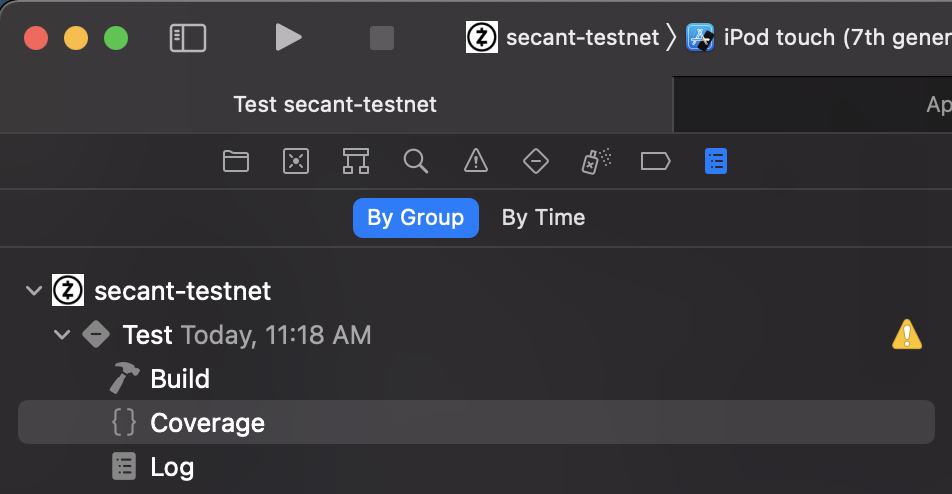
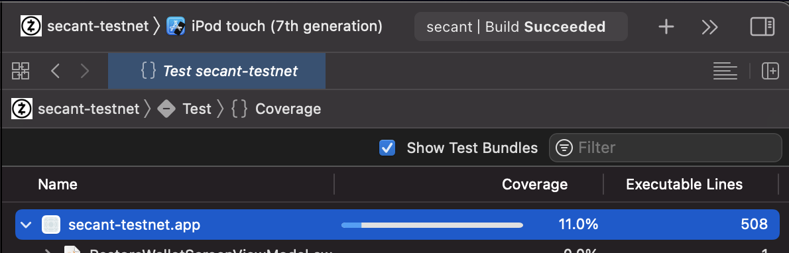

# Gathering Code Coverage

Although full coverage it's not our finality, we use this metric as a way to be aware of which code is being tested and to what extent. 

## Checking the coverage locally
Once you run the tests locally you should be able to see the tests by going to the logs pane of the project navigation panel under the coverage section for that build run.

## Coverage results

Our advice is that you run coverage before and after implementing a feature, so that you can assess how the code and tests you developed affected coverage.

